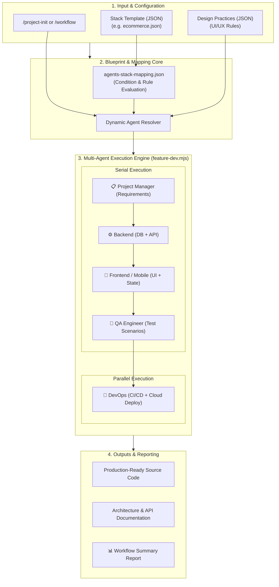

<div align="center">

# 🤖 AI Blueprint Core

**AI-Powered Multi-Agent Architecture Template & Project Orchestration System**

[](LICENSE)
[](CONTRIBUTING.md)
[](https://nodejs.org)
[](#-ready-stack-templates-matrix)
[](#-two-tier-agent-orchestration)
[](#-system-architecture)

<p align="center">
  <b>Standardized technology stacks, dynamic AI agent mappings, and end-to-end feature development workflows for modern web, mobile, and enterprise applications.</b>
</p>

[Architecture](#-system-architecture) •
[Directory Structure](#-directory-structure) •
[Stack Matrix](#-ready-stack-templates-matrix) •
[Agent System](#-two-tier-agent-orchestration) •
[Quick Start](#-quick-start) •
[Commands](#-integrated-slash-commands) •
[Contributing](#-contributing-guide)

</div>

---

## 📖 Overview

**AI Blueprint Core** is an open-core architecture library that standardizes and automates modern software development processes with AI agents such as Claude, Gemini, Antigravity, Cursor, and Copilot.

Unlike traditional prompt-based approaches:

- **Recognizes Technology Dependencies:** Injects technology-specific prompts and architectural rules for technologies such as Astro.js, Nuxt.js, .NET 8/9 Web API, MSSQL, React Native, and MAUI.
- **Two-Tier Dynamic Orchestration:** Automatically selects the required departments (Backend, Frontend, QA, DevOps, etc.) and specialized subagents (`dotnet-developer`, `astro-developer`, `azure-deploy`, etc.) for each project type.
- **Standardized & Enterprise-Ready Output:** Applies predefined UI/UX practices, security standards (KVKK/GDPR), and folder architectures instead of generating random structures.

---

## 🏗️ System Architecture

The system consists of **8 main layers**. These layers are filtered according to CLI parameters (`--project-type`, `--apps`, `--scope`, `--frameworks`) and combined into a single optimized master prompt.



---

## 📂 Directory Structure

```text
ai-blueprint-core/
├── agents/                            # Agent roles, responsibilities, and prompt definitions
│   ├── backend/                       # Backend specialists (dotnet, nodejs, database)
│   ├── frontend/                      # Frontend specialists (astro, nuxt, mobile, ui)
│   ├── devops/                        # Infrastructure specialists (vercel, azure, ci-cd)
│   ├── qa/                            # Test engineers (strategy, test-cases)
│   ├── project-manager/               # Project and requirements analysts
│   └── README.md                      # Detailed agent role guide
│
├── stacks/                            # 12+ ready-made project architecture templates
│   ├── corporate-portfolio.json       # Astro.js + SQLite / Vercel
│   ├── landing-page.json              # Astro.js / Vercel
│   ├── news-magazine.json             # Astro.js + Node/.NET + MSSQL
│   ├── ecommerce.json                 # Nuxt.js + .NET Web API + MSSQL
│   ├── classifieds.json               # Classifieds & marketplace architecture
│   ├── booking.json                   # Appointment & reservation architecture
│   ├── lms.json                       # E-learning management system
│   ├── saas-crm.json                  # SaaS / CRM multi-tenant architecture
│   ├── admin-panel.json               # Custom administration panel
│   ├── mobile-backend.json            # React Native + .NET Web API
│   ├── native-mobile.json             # .NET MAUI + SQLite/MSSQL
│   ├── hybrid-blazor-maui.json        # Blazor Hybrid + MAUI
│   └── README.md                      # Stack catalog and detailed matrix
│
├── agents-stack-mapping.json          # Rule table connecting stack technologies to agents
│
├── workflows/                         # Automated workflows and orchestration engines
│   ├── feature-dev.mjs                # Multi-agent feature development pipeline
│   └── README.md                      # Workflow execution guide
│
├── commands/                          # CLI / slash command definitions (.md)
│   ├── project-init.md                # New project initialization command
│   ├── workflow.md                    # Workflow trigger command
│   ├── review.md                      # Code and architecture review command
│   ├── rules.md                       # Coding and style rules
│   ├── setup.md                       # Environment setup instructions
│   └── init-docs.md                   # Documentation generation command
│
├── design-practices/                  # Predefined UI/UX design practices
│   ├── login-screen-split.json        # Two-column split login pattern
│   └── login-screen-blur.json         # Modern blur-effect login pattern
│
└── projects/                          # Configuration records for generated projects
```

---

## 🧩 Layer Architecture

### Recommended Model

`deepseek-v4-flash`

### Common Working Principle of Every Layer

- **Manifest (`.json`):** "What is this layer and what does it contain?" — AI's entry point
- **Rules / Patterns (`.md`):** "What should and should not be done?" — mandatory, forbidden, recommended, and optional rules
- **Templates:** Concrete code templates using the `{{Placeholder}}` format

### `00-registry/` — Version & Dependency Authority

| File | Purpose |
|---|---|
| `versions.json` | Locked versions of all packages |
| `compatibility-matrix.json` | 50+ framework compatibility rules |

**Rule:** AI never assigns package versions on its own. All versions are read from this file.

### `01-globals/` — Universal Coding Standards

| File | Scope |
|---|---|
| `code-style.md` | Naming, formatting, import ordering (kebab-case, PascalCase, camelCase, BEM CSS) |
| `strict-logic.md` | Immutability, early return, async/await, memory leak prevention |
| `security.md` | No hardcoded secrets, XSS, SQL injection, CSRF, JWT, Helmet, rate limiting |
| `performance.md` | Bundle < 200KB gzipped, code splitting, Promise.all, Web Vitals |

### `02-domains/` — Business Logic & Data Layer

Contains technology-independent business rules, database schemas, and API contracts that vary according to the project type.

Each domain consists of three files:

| File | Content |
|---|---|
| `business-logic.md` | Business rules, workflows, state machines, validation logic |
| `db-schema.json` | Tables, columns, types, indexes, foreign keys |
| `api-contracts.json` | REST API endpoints and request/response schemas |

**25 Domains:**

| Domain | Type | Domain | Type |
|---|---|---|---|
| `ai-playground` | AI interaction platform | `landing-page` | Landing page |
| `analytics-tools` | Analytics dashboard | `marketplace` | Marketplace |
| `blog-platform` | Blog/CMS | `micro-site` | Microsite |
| `booking-system` | Reservation system | `news-portal` | News portal |
| `cloud-storage` | Cloud storage | `portfolio` | Portfolio site |
| `corporate-site` | Corporate website | `realestate-portal` | Real estate portal |
| `crm-system` | Customer relationship management | `restaurant-pos` | Restaurant POS |
| `crowdfunding` | Crowdfunding | `saas-dashboard` | SaaS dashboard |
| `crypto-dashboard` | Cryptocurrency dashboard | `social-network` | Social network |
| `documentation-hub` | Documentation hub | `ecommerce` | E-commerce |
| `e-learning` | Online learning platform | `event-management` | Event management |
| `fitness-tracker` | Fitness tracking | `forum-community` | Forum/community |
| `job-board` | Job board | | |

### `03-infrastructures/` — Production-Ready Infrastructure Layer

Defines the application's operating environment and follows a **Blueprint-as-Code** approach.

| Module | Content |
|---|---|
| `docker/` | Container and orchestration (Dockerfile + docker-compose templates, 11 production rules) |
| `ci-cd/` | GitHub Actions and GitLab CI pipeline templates |
| `monitoring/` | Prometheus + Grafana + Loki observability configuration |
| `networking/` | Nginx, Traefik, Caddy reverse proxy configurations |
| `secrets/` | Secret management, `.env.example`, secure configuration |

**Cross-Cutting Rules (CC-001 — CC-007):** All placeholders must be replaced, `:latest` tags must not be used, healthchecks are mandatory, HTTPS is mandatory, secrets must never be stored in code, logs must be written as JSON to stdout, and containers must run as a non-root user.

### `04-apps/` — Reference Architecture Library (Application Skeletons)

The reference architecture library used by AI agents when generating code.

**13 Stacks:**

| Stack | Type | Language |
|---|---|---|
| `astrojs` | Static/SSR Frontend | JS/TS |
| `nextjs` | SSR/SSG Frontend | JS/TS |
| `nuxtjs` | SSR/SSG Frontend | JS/TS (Vue 3) |
| `react` | SPA Frontend | JS/TS |
| `vue` | SPA Frontend | JS/TS |
| `svelte` | Compiled Frontend | JS/TS |
| `html` | Static Frontend | HTML/CSS/JS |
| `netwebapi` | RESTful Backend | C# (.NET 8) |
| `netblazor` | WASM/Server Frontend | C# (.NET 8) |
| `netmaui` | Native Mobile | C# (.NET 8) |
| `node-express` | Lightweight Backend | JS/TS (Node.js) |
| `nodejs` | General Backend | JS/TS (Node.js) |
| `react-native` | Cross-platform Mobile | JS/TS |

Each stack contains `manifest.json` (technical constraints) + `rules.md` (best practices) + `template/` (code templates).

### `05-frameworks/` — UI Framework & Library Rules

Defines how additional packages included in a project should be configured and used.

**16 Frameworks:** `tailwindcss`, `gsap`, `swiper`, `framer-motion`, `three`, `iconify`, `fancyapps`, `chartjs`, `zustand`, `pinia`, `prisma`, `mongoose`, `mssql`, `redis`, `socket-io`, `jwt`

Each framework contains `config-rules.md` (configuration) + `best-practices.md` (performance, security) + `capability.json` (API exposed to AI).

### `06-datalayer/` — Database Integration Layer

Database connection and integration solutions required by the project.

| Source | Content |
|---|---|
| `postgresql/` | PostgreSQL connection configuration and integration template |
| `mongodb/` | MongoDB ODM configuration |
| `redis/` | Redis cache and message broker integration |
| `mssql/` | MSSQL connection and query configuration |
| `sqlite/` | SQLite embedded database integration |

Each source contains `capability.json` + `implementation_pattern.md` + `integration_template/`.

### `07-Orders/` — Master Prompt Repository

The output layer of the Blueprint system. Project requests received from users are stored here as compiled master prompt files through the cache-reversing process.

Each master prompt contains the complete project recipe in a single file: project summary, domain business logic, global rules, app stack configuration, framework rules, version information, and build instructions.

---

## 🔄 Cache-Reversing Architecture

The system works with a **cache-reversing** pattern. In the traditional approach, AI repeatedly looks back at layers whenever it needs information during the build. Cache-reversing reverses this flow: **all required information is collected before the build and embedded into the master prompt.**

```text
┌─────────────────────────────────────────────────────────────────────┐
│  PHASE 1: CREATE — Master Prompt Generation (Selective Scanning)    │
│                                                                     │
│  User parameters → AI selectively scans relevant layers             │
│  → 07-Orders/{name}-master-prompt.md (complete recipe in one file) │
├─────────────────────────────────────────────────────────────────────┤
│  PHASE 2: BUILD — Project Generation from Master Prompt             │
│                                                                     │
│  AI reads only the master prompt and does not return to the layers. │
├─────────────────────────────────────────────────────────────────────┤
│  PHASE 3: REVISION — Changes & Updates                              │
│                                                                     │
│  User requests a change → AI directly updates the master prompt     │
│  (layers are not scanned again)                                     │
└─────────────────────────────────────────────────────────────────────┘
```

### Scope-Based Filtering

| Scope | Domain | 03-infra | 06-datalayer |
|---|---|---|---|
| `frontend` + no backend | UI/UX/SEO only | Skipped | Skipped |
| `frontend` + backend | UI/UX + API/DB | Deployment only | Relevant ones |
| `backend` | Backend only | All | All |
| `fullstack` | All | All | All |

---

## 🗂️ Ready Stack Templates Matrix

The system includes **12 industry-standard architecture templates**:

| # | Stack ID | Project Type | Frontend | Backend | Database | Deployment |
|---|---|---|---|---|---|---|
| 1 | `corporate-portfolio` | Corporate & Portfolio | Astro.js (Tailwind) | Node.js (Optional) | SQLite | Vercel |
| 2 | `landing-page` | Landing Page | Astro.js | - | - | Vercel |
| 3 | `news-magazine` | News & Media Portal | Astro.js | Node.js / .NET | MSSQL | Vercel |
| 4 | `ecommerce` | E-commerce Platform | Nuxt.js (SSR) | .NET 8/9 Web API | MSSQL | Vercel + Azure |
| 5 | `classifieds` | Classifieds & Listings | Nuxt.js | .NET 8/9 Web API | MSSQL | Vercel + Azure |
| 6 | `booking` | Appointment & Reservation | Nuxt.js | .NET 8/9 Web API | MSSQL | Vercel + Azure |
| 7 | `lms` | E-learning System | Nuxt.js | .NET 8/9 Web API | MSSQL | Vercel + Azure |
| 8 | `saas-crm` | SaaS & CRM Platform | Nuxt.js | .NET 8/9 Web API | MSSQL | Vercel + Azure |
| 9 | `admin-panel` | Custom Administration Panel | Nuxt.js / Blazor | .NET 8/9 Web API | MSSQL | Vercel / Azure |
| 10 | `mobile-backend` | Mobile Backend | React Native | .NET 8/9 Web API | MSSQL | Azure |
| 11 | `native-mobile` | Native Mobile (Cross) | .NET MAUI | .NET 8/9 Web API | MSSQL / SQLite | Azure + Stores |
| 12 | `hybrid-blazor-maui` | Hybrid Mobile & Desktop | Blazor Hybrid (MAUI) | .NET 8/9 Web API | MSSQL / SQLite | Azure + Stores |

For detailed stack configuration parameters, see [`stacks/README.md`](stacks/README.md).

---

## 🔗 Two-Tier Agent Orchestration

According to the rules in `agents-stack-mapping.json`, agents operate in a hierarchical two-level structure.

### 1. Tier: Department Category

- `backend` — Database & API development
- `frontend` — User interface, state management, components
- `qa` — Test strategy, test scenarios, mock tests
- `devops` — CI/CD pipelines, Docker, cloud deployment
- `project-manager` — Requirements analysis, sprint breakdown

### 2. Tier: Domain Specialist (Subagent)

A targeted specialist is activated according to the stack requirements of a category:

- **Backend:** `dotnet-developer`, `nodejs-developer`, `database-developer`
- **Frontend:** `astro-developer`, `nuxt-developer`, `mobile-developer`, `ui-designer`
- **DevOps:** `vercel-deploy`, `azure-deploy`, `ci-cd-pipeline`
- **QA:** `testing-strategy`, `test-cases`
- **PM:** `requirements`, `progress-tracking`

### ⚡ Execution Strategies

- **`serial`:** The previous agent's output becomes the next agent's input (e.g. DB Schema ➔ API Controller ➔ Frontend Page ➔ QA Test).
- **`parallel`:** Independent tasks are executed simultaneously (e.g. deployment configuration and documentation).

---

## 🚀 Quick Start

### 1. Start a New Project (`project-init`)

Select a project type to initialize the project and its architecture configuration within seconds:

```bash
/project-init my-store --stack ecommerce --name "Online Store"
```

**What happens?**

1. `projects/my-store.json` configuration is generated.
2. The selected `ecommerce.json` stack rules are copied into the project.
3. The project directory and basic architecture skeleton are prepared.

### 2. Feature Development Flow (`feature-dev`)

To develop a new feature in an existing project:

```bash
/workflow feature-dev --stack ecommerce --feature "Shopping Cart and Discount Coupon Module"
```

Agents work sequentially to produce:

- 🗄️ **Database Subagent:** SQL migration scripts and table models
- ⚡ **Backend Subagent:** CQRS/Controller, Service, and DTO classes
- 🖥️ **Frontend Subagent:** Vue/Nuxt components, Pinia store, and responsive pages
- 🧪 **QA Subagent:** Unit & Integration test files
- 📊 **DevOps Subagent:** Deployment & CI/CD configuration

---

## 🛠️ Integrated Slash Commands

| Command | Description | Example |
|---|---|---|
| `/project-init` | Creates a new project configuration using the selected stack | `/project-init blog-app --stack news-magazine` |
| `/workflow` | Runs defined workflows (`feature-dev`, `test`, `lint-fix`, `deploy-check`) | `/workflow feature-dev --stack saas-crm --feature "Billing Module"` |
| `/review` | Reviews code quality, security, and architectural compliance | `/review --scope full` |
| `/rules` | Lists project coding standards and best-practice rules | `/rules` |
| `/setup` | Provides environment dependencies and developer setup steps | `/setup` |
| `/init-docs` | Automatically generates project architecture and API documentation | `/init-docs` |

---

## 🧰 Usage

### Parameters

| Parameter | Description | Example |
|---|---|---|
| `--project-type` | Project type (domain name from `02-domains`) | `landing-page`, `ecommerce` |
| `--apps` | Stack to use (name from `04-apps`) | `html`, `nextjs`, `netwebapi` |
| `--scope` | Scope | `frontend`, `backend`, `fullstack` |
| `--frameworks` | Framework list (comma-separated) | `tailwindcss,gsap,iconify` |
| `--feature` | Project details (colors, fonts, content) | Free text |
| `--name` | Project name | `Avşa Pension` |

### Example Parameters

```text
--project-type "landing-page"
--apps "html"
--scope "frontend"
--frameworks "tailwindcss,swiper,iconify,gsap"
--feature "Dark-themed, single-page gym promotional website"
--name "Zafer Gym"
```

### Process

**Phase 1 — Master Prompt Generation:**

1. AI receives the user parameters.
2. It selectively scans the relevant layers according to the scope.
3. It combines all information into a single master prompt (`07-Orders/`).
4. It presents the result to the user for review.

**Phase 2 — Project Build:**

1. The user approves the master prompt (`<!-- APPROVED -->`).
2. AI builds the project using only the master prompt.
3. It does not return to the layers — all required information is already in the master prompt.

---

## 🤖 Using the System with a New AI

This system can be used by any AI model with zero initial context:

1. **System Prompt:** Provide `system_prompt.md` to the AI as its system prompt.
2. **Directory Access:** Give read access to the entire `ai-blueprint-core/` directory.
3. **User Parameters:** Enter the parameters as the first message.

The AI selectively scans the layers according to the instructions in `system_prompt.md`, creates the master prompt, and builds the project.

**Important notes:**

- AI never modifies the layers on its own; it only reads them.
- AI does not build without the `<!-- APPROVED -->` header in the master prompt.
- Revision requests are made directly on the master prompt; the layers are not scanned again.

---

## 📋 Placeholder Conventions

| Format | Example |
|---|---|
| PascalCase | `{{ProjectName}}` |
| camelCase | `{{projectName}}` |
| kebab-case | `{{project-name}}` |
| snake_case | `{{project_name}}` |
| SCREAMING_SNAKE | `{{PROJECT_NAME}}` |

---

## 🎯 Goal

Enable AI to generate a **production-ready project that follows best practices from a business logic definition**.

Everything is based on one principle:

> Instead of telling AI everything, provide **only what it needs at that moment, in the correct format, with precise rules**.

---

## 🤝 Contributing Guide

Community contributions are welcome! You can add a new technology stack, agent specialization, or workflow by following the steps below.

### 🌟 Step-by-Step Contribution Process (GitHub Workflow)

```bash
# 1. Fork the repository to your GitHub account and clone it locally
git clone https://github.com/<your-username>/ai-blueprint-core.git
cd ai-blueprint-core

# 2. Create a new feature/fix branch
git checkout -b feature/add-fastapi-stack

# 3. Make and validate your changes
# (e.g. add a new stack or agent definition)

# 4. Commit your changes (Conventional Commits standard)
git commit -m "feat(stacks): add fastapi-postgresql python stack template"

# 5. Push to your fork
git push origin feature/add-fastapi-stack

# 6. Open a Pull Request (PR) to the main repository through GitHub
```

### 🧩 1. Adding a New Stack

1. Create `stacks/<new-stack-id>.json` (you can use `ecommerce.json` as a template).
2. Fill in the stack's `frontend`, `backend`, `database`, `deploy`, `uiLibraries`, and `departmentPrompts` fields.
3. Add the stack condition (`stackAgentRules`) to `agents-stack-mapping.json`.
4. Add the new stack to `stacks/README.md` and the main `README.md` matrix.

### 🤖 2. Adding a New Agent (Subagent)

1. Create `agents/<category>/<subagent-name>.md`.
2. Use the following headings: `# Role`, `## Responsibilities`, `## Output Format`, `## Coding Standards`.
3. Add the new subagent to the `categories[category].subagents` list in `agents-stack-mapping.json`.

### 📐 3. Adding a New Design Practice

1. Create `design-practices/<practice-name>.json`.
2. Define component structure, responsive rules, color palette, and accessibility (a11y) standards.

---

## 🗺️ Roadmap

- [x] 12 Core Stack Templates & Two-Tier Agent Orchestration
- [x] Node.js-Based `feature-dev.mjs` Pipeline Engine
- [ ] **Python / FastAPI + PostgreSQL** Stack Template
- [ ] **Go / Fiber + PostgreSQL** Stack Template
- [ ] **MCP (Model Context Protocol) Server Integration** (Direct communication between agents and IDE/CLI)
- [ ] Automated Benchmark & Code Quality Scoring System
- [ ] Multi-Language Support (EN / TR Documentation Option)

---

## 📄 License

This project is licensed under the [MIT License](LICENSE). You are free to use, customize, and contribute to it.

<div align="center">
  <sub>Built to standardize AI-focused software architecture development.</sub>
</div>
