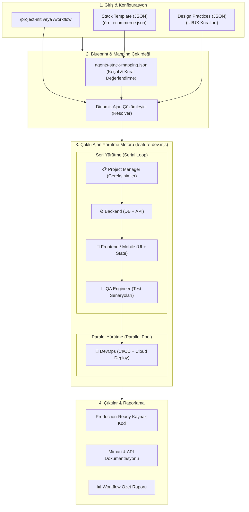

<<<<<<< HEAD
# 🏗️ AI Blueprint Core — AI Kod Asistanları İçin Şablon Mimarisi

Bu proje, **Claude Code, Cursor, Aider** veya lokal LLM'ler (Ollama vb.) gibi yapay zeka kodlama asistanlarının token tüketimini minimize etmek ve halüsinasyon (yanlış kod üretimi) riskini azaltmak amacıyla geliştirilmiş modüler bir bağlam (context) mimarisidir.

Yapay zekaya "Bana bir e-ticaret sitesi yap" demek yerine, sistem CLI parametrelerine göre ilgili katmanları seçici biçimde tarar ve modele sadece **ihtiyacı olan spesifik kuralları, mimariyi ve veritabanı şemalarını** içeren bir master-prompt sunar.
=======
<div align="center">

# 🤖 AI Blueprint Core

**Yapay Zeka Destekli Çoklu Ajan (Multi-Agent) Mimari Şablon & Proje Orkestrasyon Sistemi**

[](LICENSE)
[](CONTRIBUTING.md)
[](https://nodejs.org)
[](#-hazır-stack-şablonları-matrisi)
[](#-iki-kademeli-ajan-orkestrasyonu)
[](#-sistem-mimarisi)

<p align="center">
  <b>Modern web, mobil ve kurumsal uygulamalar için standartlaştırılmış teknoloji yığınları, dinamik yapay zeka ajan eşlemeleri ve uçtan uca feature geliştirme iş akışları.</b>
</p>

[Mimarî](#-sistem-mimarisi) •
[Dizin Yapısı](#-dizin-yapısı) •
[Stack Matrisi](#-hazır-stack-şablonları-matrisi) •
[Ajan Sistemi](#-iki-kademeli-ajan-orkestrasyonu) •
[Hızlı Başlangıç](#-hızlı-başlangıç) •
[Komutlar](#-entegre-komutlar-slash-commands) •
[Katkıda Bulunma](#-katkıda-bulunma-rehberi-contributing)

---

</div>

## 📖 Genel Bakış

**AI Blueprint Core**, modern yazılım geliştirme süreçlerini yapay zeka ajanları (Claude, Gemini, Antigravity, Cursor, Copilot vb.) ile standartlaştıran ve otomatikleştiren açık çekirdekli bir mimari kütüphanedir.

Klasik prompt tabanlı yaklaşımların aksine:
- **Teknoloji Bağımlılıklarını Tanır:** Astro.js, Nuxt.js, .NET 8/9 Web API, MSSQL, React Native, MAUI gibi spesifik teknolojilere uygun prompt ve mimari kural enjekte eder.
- **İki Kademeli Dinamik Orkestrasyon:** Her proje tipine göre gereken departmanları (Backend, Frontend, QA, DevOps vb.) ve alt uzmanları (`dotnet-developer`, `astro-developer`, `azure-deploy` vb.) otomatik seçer.
- **Standart & Kurumsal Çıktı:** Kod oluştururken rastgele yapılar yerine önceden tanımlanmış UI/UX pratikleri, güvenlik standartları (KVKK/GDPR) ve klasör mimarilerini uygular.
>>>>>>> 9dedac147c5903601773520c34b338fa82251c46

---

## 📂 Katman Mimarisi (8 Katman)

Sistem 8 ana katmandan oluşur. Bu katmanlar, gelen CLI parametrelerine göre (`--project-type`, `--apps`, `--scope`, `--frameworks`) filtrelenerek tek bir optimize master-prompt'ta birleştirilir.

<<<<<<< HEAD
```
ai-blueprint-core/
│
├── 00-registry/          ← Versiyon ve uyumluluk otoritesi
├── 01-globals/           ← Evrensel kodlama standartları
├── 02-domains/           ← İş mantığı ve veri katmanı (25 domain)
├── 03-infrastructures/   ← Production altyapı katmanı
├── 04-apps/              ← Uygulama iskelet kütüphanesi (13 stack)
├── 05-frameworks/        ← UI framework ve kütüphane kuralları (16 framework)
├── 06-datalayer/         ← Veritabanı bağlantı ve entegrasyon katmanı
└── 07-Orders/            ← Master-prompt ve sipariş çıktıları
=======


---

## 📁 Dizin Yapısı

```
ai-blueprint-core/
├── agents/                            # Ajan rol, sorumluluk ve prompt tanımları
│   ├── backend/                       # Backend uzmanları (dotnet, nodejs, database)
│   ├── frontend/                      # Frontend uzmanları (astro, nuxt, mobile, ui)
│   ├── devops/                        # Altyapı uzmanları (vercel, azure, ci-cd)
│   ├── qa/                            # Test mühendisleri (strategy, test-cases)
│   ├── project-manager/               # Proje ve gereksinim analistleri
│   └── README.md                      # Ajan rolleri detay rehberi
│
├── stacks/                            # 12+ Hazır proje mimari şablonları
│   ├── corporate-portfolio.json       # Astro.js + SQLite / Vercel
│   ├── landing-page.json              # Astro.js / Vercel
│   ├── news-magazine.json             # Astro.js + Node/.NET + MSSQL
│   ├── ecommerce.json                 # Nuxt.js + .NET Web API + MSSQL
│   ├── classifieds.json               # İlan & Pazar yeri mimarisi
│   ├── booking.json                   # Randevu & Rezervasyon mimarisi
│   ├── lms.json                       # E-Öğrenme yönetim sistemi
│   ├── saas-crm.json                  # SaaS / CRM çok kiracılı mimari
│   ├── admin-panel.json               # Özel Yönetim Paneli
│   ├── mobile-backend.json            # React Native + .NET Web API
│   ├── native-mobile.json             # .NET MAUI + SQLite/MSSQL
│   ├── hybrid-blazor-maui.json        # Blazor Hybrid + MAUI
│   └── README.md                      # Stack kataloğu ve detaylı matris
│
├── agents-stack-mapping.json          # Stack teknolojilerini ajanlara bağlayan kural tablosu
│
├── workflows/                         # Otomatik iş akışı ve orkestrasyon motorları
│   ├── feature-dev.mjs                # Çoklu ajan feature geliştirme pipeline'ı
│   └── README.md                      # Workflow çalıştırma rehberi
│
├── commands/                          # CLI / Slash command tanımları (.md)
│   ├── project-init.md                # Yeni proje başlatma komutu
│   ├── workflow.md                    # Workflow tetikleme komutu
│   ├── review.md                      # Kod ve mimari inceleme komutu
│   ├── rules.md                       # Kodlama ve stil kuralları
│   ├── setup.md                       # Ortam kurulum yönergeleri
│   └── init-docs.md                   # Dokümantasyon üretme komutu
│
├── design-practices/                  # Önceden tanımlı UI/UX tasarım pratikleri
│   ├── login-screen-split.json        # İki kolonlu split login deseni
│   └── login-screen-blur.json         # Modern blur efektli login deseni
│
└── projects/                          # Oluşturulan projelere ait konfigürasyon kayıtları
>>>>>>> 9dedac147c5903601773520c34b338fa82251c46
```

## Tavsiye Edilen Modeller
deepseek-v4-flash

**Her katmanın ortak çalışma prensibi:**
- **Manifest (.json):** "Bu katman nedir, neleri içerir?" — AI'nın giriş noktası
- **Rules / Patterns (.md):** "Ne yapılır, ne yapılmaz?" — zorunlu, yasak, önerilen ve opsiyonel kurallar
- **Templates:** Somut kod şablonları — `{{Placeholder}}` formatı

---

<<<<<<< HEAD
### `00-registry/` — Versiyon ve Bağımlılık Otoritesi

| Dosya | İşlev |
|-------|-------|
| `versions.json` | Tüm paketlerin kilitli versiyonları |
| `compatibility-matrix.json` | 50+ framework uyumluluk kuralı |

**Kural:** AI, paket versiyonlarını asla kendi başına atamaz. Tüm versiyonlar bu dosyadan okunur.

---

### `01-globals/` — Evrensel Kodlama Standartları

| Dosya | Kapsam |
|-------|--------|
| `code-style.md` | İsimlendirme, format, import sıralaması (kebab-case, PascalCase, camelCase, BEM CSS) |
| `strict-logic.md` | Immutability, early return, async/await, memory leak önleme |
| `security.md` | Hardcoded secret yasak, XSS, SQL injection, CSRF, JWT, Helmet, rate limiting |
| `performance.md` | Bundle < 200KB gzipped, code splitting, Promise.all, Web Vitals |

---

### `02-domains/` — İş Mantığı ve Veri Katmanı

Proje türüne göre değişen, kullanılan teknolojiden bağımsız iş kuralları, veritabanı şemaları ve API sözleşmeleri.

Her domain 3 dosyadan oluşur:

| Dosya | İçerik |
|-------|--------|
| `business-logic.md` | İş kuralları, workflow'lar, state machine'ler, validasyon mantığı |
| `db-schema.json` | Tablolar, sütunlar, tipler, index'ler, foreign key'ler |
| `api-contracts.json` | REST API endpoint'leri, request/response şemaları |

**25 Domain:**

| Domain | Tür | Domain | Tür |
|--------|-----|--------|-----|
| `ai-playground` | AI etkileşim platformu | `landing-page` | Tanıtım sayfası |
| `analytics-tools` | Analitik dashboard | `marketplace` | Pazar yeri |
| `blog-platform` | Blog/CMS | `micro-site` | Mikro site |
| `booking-system` | Rezervasyon sistemi | `news-portal` | Haber portalı |
| `cloud-storage` | Bulut depolama | `portfolio` | Portfolyo sitesi |
| `corporate-site` | Kurumsal web sitesi | `realestate-portal` | Emlak portalı |
| `crm-system` | Müşteri ilişkileri yönetimi | `restaurant-pos` | Restoran POS |
| `crowdfunding` | Kitle fonlaması | `saas-dashboard` | SaaS yönetim paneli |
| `crypto-dashboard` | Kripto para dashboard | `social-network` | Sosyal ağ |
| `documentation-hub` | Dokümantasyon merkezi | `ecommerce` | E-ticaret |
| `e-learning` | Online eğitim platformu | `event-management` | Etkinlik yönetimi |
| `fitness-tracker` | Fitness takip | `forum-community` | Forum/topluluk |
| `job-board` | İş ilanı platformu | | |

---

### `03-infrastructures/` — Production-Ready Altyapı Katmanı

Uygulamanın işletim ortamını tanımlar. "Blueprint-as-Code" yaklaşımıyla çalışır.

| Modül | İçerik |
|-------|--------|
| `docker/` | Container ve orchestration (Dockerfile + docker-compose şablonları, 11 production kuralı) |
| `ci-cd/` | GitHub Actions ve GitLab CI pipeline şablonları |
| `monitoring/` | Prometheus + Grafana + Loki gözlemlenebilirlik yapılandırması |
| `networking/` | Nginx, Traefik, Caddy reverse proxy yapılandırmaları |
| `secrets/` | Secret yönetimi, .env.example, güvenli yapılandırma |

**Cross-Cutting Kurallar (CC-001 — CC-007):** Tüm placeholder'lar değiştirilmeli, `:latest` tag kullanılmamalı, healthcheck zorunlu, HTTPS zorunlu, secret'lar asla kodda olmamalı, log'lar JSON stdout'a, non-root user ile container çalıştırılmalı.

---

### `04-apps/` — Referans Mimari Kütüphanesi (Application Skeletons)

AI ajanlarının kod üretirken başvurduğu referans mimari kütüphanesi.

**13 Stack:**

| Stack | Tür | Dil |
|-------|-----|-----|
| `astrojs` | Static/SSR Frontend | JS/TS |
| `nextjs` | SSR/SSG Frontend | JS/TS |
| `nuxtjs` | SSR/SSG Frontend | JS/TS (Vue 3) |
| `react` | SPA Frontend | JS/TS |
| `vue` | SPA Frontend | JS/TS |
| `svelte` | Compiled Frontend | JS/TS |
| `html` | Static Frontend | HTML/CSS/JS |
| `netwebapi` | RESTful Backend | C# (.NET 8) |
| `netblazor` | WASM/Server Frontend | C# (.NET 8) |
| `netmaui` | Native Mobile | C# (.NET 8) |
| `node-express` | Hafif Backend | JS/TS (Node.js) |
| `nodejs` | Genel Backend | JS/TS (Node.js) |
| `react-native` | Cross-platform Mobile | JS/TS |

Her stack: `manifest.json` (teknik kısıtlar) + `rules.md` (best practice'ler) + `template/` (kod şablonları)

---

### `05-frameworks/` — UI Framework ve Kütüphane Kuralları

Projeye dahil edilen ek paketlerin nasıl yapılandırılacağını ve kullanılacağını belirtir.

**16 Framework:** `tailwindcss`, `gsap`, `swiper`, `framer-motion`, `three`, `iconify`, `fancyapps`, `chartjs`, `zustand`, `pinia`, `prisma`, `mongoose`, `mssql`, `redis`, `socket-io`, `jwt`

Her framework: `config-rules.md` (konfigürasyon) + `best-practices.md` (performans, güvenlik) + `capability.json` (AI'ya açık API)

---

### `06-datalayer/` — Veritabanı Entegrasyon Katmanı

Projenin ihtiyaç duyduğu veritabanı bağlantı ve entegrasyon çözümleri.

| Kaynak | İçerik |
|--------|--------|
| `postgresql/` | PostgreSQL bağlantı yapılandırması ve integration template |
| `mongodb/` | MongoDB ODM yapılandırması |
| `redis/` | Redis cache ve message broker entegrasyonu |
| `mssql/` | MSSQL bağlantı ve sorgu yapılandırması |
| `sqlite/` | SQLite embedded veritabanı entegrasyonu |

Her kaynak: `capability.json` + `implementation_pattern.md` + `integration_template/`

---

### `07-Orders/` — Master-Prompt Deposu

Blueprint sisteminin çıktı katmanı. Kullanıcıdan gelen proje talepleri, cache-reversing süreciyle derlenmiş master-prompt dosyaları halinde burada saklanır.

Her master-prompt, projenin tüm reçetesini tek dosyada içerir: proje özeti, domain iş mantığı, global kurallar, app stack konfigürasyonu, framework kuralları, versiyon bilgileri ve build talimatları.

---

## 🔄 Cache-Reversing Mimarisi

Bu sistem **cache-reversing** pattern'i ile çalışır. Geleneksel yaklaşımda AI build sırasında ihtiyaç duydukça katmanlara tekrar tekrar bakar. Cache-reversing bu akışı tersine çevirir: **tüm gerekli bilgi, build'den önce toplanıp master-prompt'e gömülür.**

```
┌─────────────────────────────────────────────────────────────────────┐
│  FAZ 1: CREATE — Master-Prompt Oluşturma (Seçici Katman Taraması)   │
│                                                                     │
│  Kullanıcı parametreleri → AI ilgili katmanları seçici biçimde tarar│
│  → 07-Orders/{name}-master-prompt.md (tüm reçete tek dosyada)       │
├─────────────────────────────────────────────────────────────────────┤
│  FAZ 2: BUILD — Master-Prompt'tan Proje Üretimi                     │
│                                                                     │
│  AI sadece master-prompt'i okur, katmanlara geri dönmez.            │
├─────────────────────────────────────────────────────────────────────┤
│  FAZ 3: REVISION — Değişiklik ve Güncelleme                         │
│                                                                     │
│  Kullanıcı değişiklik ister → AI master-prompt'i doğrudan günceller  │
│  (katmanlar yeniden taranmaz)                                        │
└─────────────────────────────────────────────────────────────────────┘
```

### Scope Bazlı Filtreleme

| Scope | Domain | 03-infra | 06-datalayer |
|-------|--------|----------|--------------|
| `frontend` + backend yok | Sadece UI/UX/SEO | Atlanır | Atlanır |
| `frontend` + backend var | UI/UX + API/DB | Sadece deployment | İlgili olanlar |
| `backend` | Sadece backend | Tamamı | Tamamı |
| `fullstack` | Tamamı | Tamamı | Tamamı |

---

## 🚀 Kullanım

### Parametreler

| Parametre | Açıklama | Örnek |
|-----------|----------|-------|
| `--project-type` | Proje türü (02-domains'teki domain adı) | `landing-page`, `ecommerce` |
| `--apps` | Kullanılacak stack (04-apps'teki ad) | `html`, `nextjs`, `netwebapi` |
| `--scope` | Kapsam | `frontend`, `backend`, `fullstack` |
| `--frameworks` | Framework listesi (virgülle ayrılmış) | `tailwindcss,gsap,iconify` |
| `--feature` | Proje detayları (renk, font, içerik) | Serbest metin |
| `--name` | Proje adı | `Avşa Pansiyon` |

### Örnek Komut

```
--project-type "landing-page"
--apps "html"
--scope "frontend"
--frameworks "tailwindcss,swiper,iconify,gsap"
--feature "Koyu temalı, tek sayfa spor salonu tanıtım sitesi"
--name "Zafer Spor Salonu"
```

### Süreç

**Aşama 1 — Master-Prompt Oluşturma:**
1. AI, kullanıcı parametrelerini alır
2. Scope'a göre ilgili katmanları seçici biçimde tarar
3. Tüm bilgiyi tek bir master-prompt'ta birleştirir (`07-Orders/`)
4. Kullanıcıya incelemesi için sunar

**Aşama 2 — Proje Build:**
1. Kullanıcı master-prompt'u onaylar (`<!-- APPROVED -->`)
2. AI sadece master-prompt'i okuyarak projeyi inşa eder
3. Katmanlara geri dönmez — tüm bilgi master-prompt'tadır

---

## 🤖 Yeni Bir AI ile Kullanım

Bu sistem, herhangi bir AI modeli tarafından sıfır bağlamla kullanılabilir:

1. **Sistem Prompt'u:** `system_prompt.md` dosyasını AI'ya sistem prompt'u olarak verin
2. **Dizin Erişimi:** `ai-blueprint-core/` dizininin tamamına okuma erişimi
3. **Kullanıcı Parametreleri:** İlk mesaj olarak parametreleri girin

AI, `system_prompt.md`'deki talimatlarla katmanları seçici biçimde tarar, master-prompt oluşturur ve projeyi inşa eder.

**Önemli notlar:**
- AI katmanları asla kendi başına değiştirmez, sadece okur
- AI, master-prompt'ta `<!-- APPROVED -->` header'ı olmadan build yapmaz
- Revizyon istekleri doğrudan master-prompt üzerinde yapılır, katmanlar yeniden taranmaz

---

## 📋 Placeholder Konvansiyonları

| Format | Örnek |
|--------|-------|
| PascalCase | `{{ProjectName}}` |
| camelCase | `{{projectName}}` |
| kebab-case | `{{project-name}}` |
| snake_case | `{{project_name}}` |
| SCREAMING_SNAKE | `{{PROJECT_NAME}}` |

---

## 🎯 Hedef

AI'nın, bir iş mantığı tanımından yola çıkarak, best practice'lere uygun, production-ready bir proje üretebilmesi.

Her şey tek bir prensibe dayanır: AI'ya her şeyi anlatmak yerine, **sadece o an ihtiyacı olanı, doğru formatta, kesin kurallarla** vermek.
=======
## 🗂️ Hazır Stack Şablonları Matrisi

Sistem bünyesinde 12 adet endüstri standardı mimari şablon yer alır:

| # | Stack ID | Proje Türü | Frontend | Backend | Database | Deployment |
|---|----------|------------|----------|---------|----------|------------|
| 1 | `corporate-portfolio` | Kurumsal & Portfolyo | Astro.js (Tailwind) | Node.js (Opsiyonel) | SQLite | Vercel |
| 2 | `landing-page` | Landing Page | Astro.js | - | - | Vercel |
| 3 | `news-magazine` | Haber & Medya Portalı | Astro.js | Node.js / .NET | MSSQL | Vercel |
| 4 | `ecommerce` | E-Ticaret Platformu | Nuxt.js (SSR) | .NET 8/9 Web API | MSSQL | Vercel + Azure |
| 5 | `classifieds` | İlan & Seri İlanlar | Nuxt.js | .NET 8/9 Web API | MSSQL | Vercel + Azure |
| 6 | `booking` | Randevu & Rezervasyon | Nuxt.js | .NET 8/9 Web API | MSSQL | Vercel + Azure |
| 7 | `lms` | E-Öğrenme Sistemi | Nuxt.js | .NET 8/9 Web API | MSSQL | Vercel + Azure |
| 8 | `saas-crm` | SaaS & CRM Platformu | Nuxt.js | .NET 8/9 Web API | MSSQL | Vercel + Azure |
| 9 | `admin-panel` | Özel Yönetim Paneli | Nuxt.js / Blazor | .NET 8/9 Web API | MSSQL | Vercel / Azure |
| 10 | `mobile-backend` | Mobil Backend | React Native | .NET 8/9 Web API | MSSQL | Azure |
| 11 | `native-mobile` | Native Mobil (Cross) | .NET MAUI | .NET 8/9 Web API | MSSQL / SQLite | Azure + Stores |
| 12 | `hybrid-blazor-maui` | Hibrit Mobil & Masaüstü | Blazor Hybrid (MAUI) | .NET 8/9 Web API | MSSQL / SQLite | Azure + Stores |

Detaylı stack konfigürasyon parametreleri için [stacks/README.md](stacks/README.md) dosyasını inceleyin.

---

## 🔗 İki Kademeli Ajan Orkestrasyonu

`agents-stack-mapping.json` kurallarına göre ajanlar hiyerarşik iki seviyede çalışır:

### 1. Seviye: Departman Kategorisi (Category)
- `backend` (Veritabanı & API geliştirme)
- `frontend` (Kullanıcı arayüzü, state yönetimi, componentler)
- `qa` (Test stratejisi, test senaryoları, mock testler)
- `devops` (CI/CD pipeline, Docker, cloud deployment)
- `project-manager` (Gereksinim analizi, sprint breakdown)

### 2. Seviye: Alan Uzmanı (Subagent)
Bir kategoride stack'in gereksinimine göre nokta atışı uzman devreye girer:
- **Backend:** `dotnet-developer`, `nodejs-developer`, `database-developer`
- **Frontend:** `astro-developer`, `nuxt-developer`, `mobile-developer`, `ui-designer`
- **DevOps:** `vercel-deploy`, `azure-deploy`, `ci-cd-pipeline`
- **QA:** `testing-strategy`, `test-cases`
- **PM:** `requirements`, `progress-tracking`

### ⚡ Yürütme Stratejileri
- **`serial` (Sıralı):** Önceki ajanın çıktısı sonraki ajanın girdisi olur (örn. DB Şeması ➔ API Controller ➔ Frontend Sayfası ➔ QA Testi).
- **`parallel` (Eşzamanlı):** Birbirine bağımlı olmayan görevler aynı anda yürütülür (örn. Dağıtım yapılandırmaları, dokümantasyon).

---

## 🚀 Hızlı Başlangıç

### 1. Yeni Proje Başlatma (`project-init`)

Bir proje türünü seçerek projeyi ve mimari konfigürasyonunu saniyeler içinde başlatın:

```bash
/project-init my-store --stack ecommerce --name "Online Mağaza"
```

**Ne gerçekleşir?**
1. `projects/my-store.json` konfigürasyonu üretilir.
2. Seçilen `ecommerce.json` stack kuralları projeye kopyalanır.
3. Proje dizini ve temel mimari iskeleti hazırlanır.

### 2. Özellik Geliştirme Akışı (`feature-dev`)

Mevcut bir projede yeni bir özellik geliştirmek için:

```bash
/workflow feature-dev --stack ecommerce --feature "Sepet ve İndirim Kuponu Modülü"
```

Ajanlar sırayla çalışarak şunları üretir:
- 🗄️ **Database Subagent:** SQL migration scriptleri ve tablo modelleri
- ⚡ **Backend Subagent:** CQRS/Controller, Service ve DTO sınıfları
- 🖥️ **Frontend Subagent:** Vue/Nuxt componentleri, Pinia store ve responsive sayfalar
- 🧪 **QA Subagent:** Unit & Integration test dosyaları
- 📊 **DevOps Subagent:** Deployment & CI/CD yapılandırması

---

## 🛠️ Entegre Komutlar (Slash Commands)

| Komut | Açıklama | Örnek |
|-------|----------|-------|
| `/project-init` | Seçilen stack ile yeni bir proje konfigürasyonu oluşturur | `/project-init blog-app --stack news-magazine` |
| `/workflow` | Tanımlı iş akışlarını (`feature-dev`, `test`, `lint-fix`, `deploy-check`) çalıştırır | `/workflow feature-dev --stack saas-crm --feature "Fatura Modülü"` |
| `/review` | Kod kalitesi, güvenlik ve mimari uyumluluk incelemesi yapar | `/review --scope full` |
| `/rules` | Proje kodlama standartları ve best-practice kurallarını listeler | `/rules` |
| `/setup` | Ortam bağımlılıkları ve geliştirici kurulum adımlarını sunar | `/setup` |
| `/init-docs` | Proje mimarisi ve API dokümantasyonunu otomatik üretir | `/init-docs` |

---

## 🤝 Katkıda Bulunma Rehberi (Contributing)

Topluluk katkılarını memnuniyetle karşılıyoruz! Yeni bir teknoloji stack'i, yeni bir ajan uzmanlığı veya workflow eklemek için aşağıdaki adımları izleyebilirsiniz.

### 🌟 Adım Adım Katkı Süreci (GitHub Workflow)

```bash
# 1. Depoyu kendi GitHub hesabınıza Fork edin ve lokale klonlayın
git clone https://github.com/<kullanici-adiniz>/ai-blueprint-core.git
cd ai-blueprint-core

# 2. Yeni bir feature/fix dalı (branch) açın
git checkout -b feature/add-fastapi-stack

# 3. Geliştirmelerinizi yapın ve doğrulayın
# (Örn: Yeni stack veya yeni agent tanımı ekleme)

# 4. Değişikliklerinizi commit edin (Conventional Commits standardı)
git commit -m "feat(stacks): add fastapi-postgresql python stack template"

# 5. Kendi forkladığınız depoya pushlayın
git push origin feature/add-fastapi-stack

# 6. GitHub üzerinden ana depoya (upstream) Pull Request (PR) açın
```

---

### 🧩 1. Yeni Bir Stack Eklemek
1. `stacks/<yeni-stack-id>.json` dosyasını oluşturun (`ecommerce.json` dosyasını şablon olarak baz alabilirsiniz).
2. Stack'in `frontend`, `backend`, `database`, `deploy`, `uiLibraries` ve `departmentPrompts` alanlarını doldurun.
3. `agents-stack-mapping.json` dosyasına girerek stack koşulunu (`stackAgentRules`) ekleyin.
4. `stacks/README.md` ve ana `README.md` matrisine yeni stack'i dahil edin.

### 🤖 2. Yeni Bir Ajan (Subagent) Eklemek
1. `agents/<kategori>/<subagent-adi>.md` dosyasını oluşturun.
2. Format olarak `# Rol`, `## Sorumluluklar`, `## Çıktı Formatı`, `## Kodlama Standartları` başlıklarını kullanın.
3. `agents-stack-mapping.json` içerisindeki `categories[kategori].subagents` listesine yeni subagent'ı ekleyin.

### 📐 3. Yeni Bir Tasarım Pratiği (Design Practice) Eklemek
1. `design-practices/<pratik-adi>.json` dosyasını oluşturun.
2. Bileşen yapısı, responsive kurallar, renk paleti ve erişilebilirlik (a11y) standartlarını tanımlayın.

---

## 🗺️ Yol Haritası (Roadmap)

- [x] 12 Temel Stack Şablonu & İki Kademeli Ajan Orkestrasyonu
- [x] Node.js Tabanlı `feature-dev.mjs` Pipeline Motoru
- [ ] **Python / FastAPI + PostgreSQL** Stack Şablonu
- [ ] **Go / Fiber + PostgreSQL** Stack Şablonu
- [ ] **MCP (Model Context Protocol) Server Entegrasyonu** (Ajanların IDE ve CLI ile doğrudan haberleşmesi)
- [ ] Otomatik Benchmark & Kod Kalite Puanlama Sistemi
- [ ] Çoklu Dil Desteği (EN / TR Döküman Seçeneği)

---

## 📄 Lisans

Bu proje [MIT Lisansı](LICENSE) altında lisanslanmıştır. Dilediğiniz gibi kullanabilir, özelleştirebilir ve katkıda bulunabilirsiniz.

<div align="center">
  <sub>Yapay zeka odaklı yazılım mimarisi geliştirmeyi standartlaştırmak amacıyla geliştirilmiştir.</sub>
</div>
>>>>>>> 9dedac147c5903601773520c34b338fa82251c46
